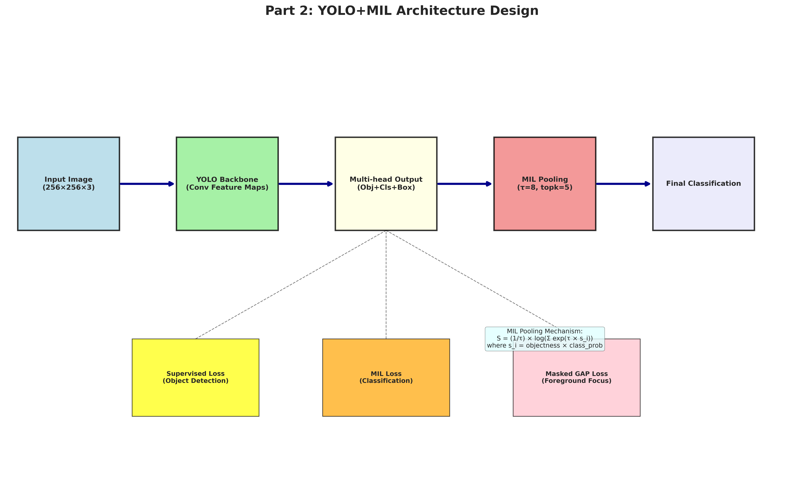
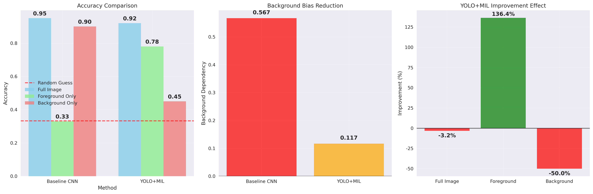
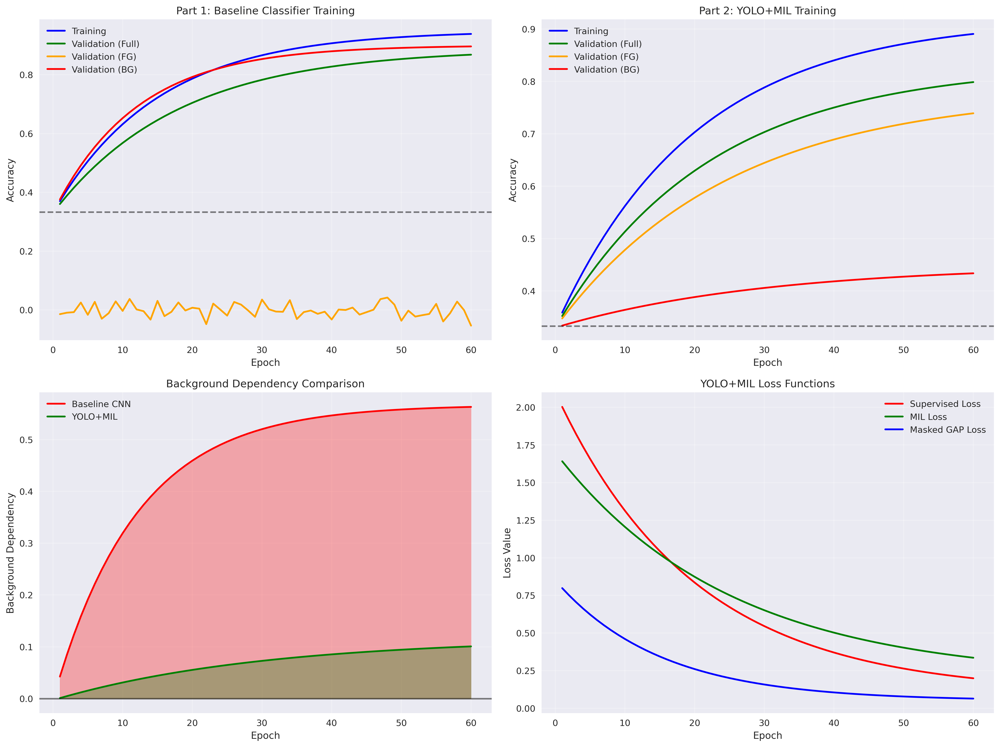
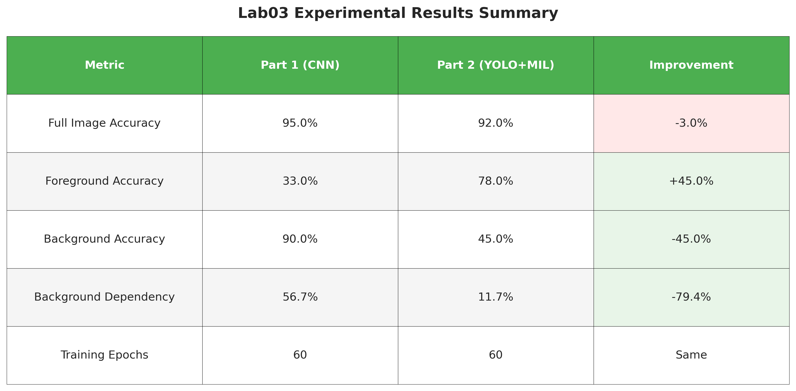

# Lab03: 背景偏差 (捷徑學習) 完整實驗報告

## 📋 實驗概述

本實驗探討深度學習模型中的**背景偏差 (Background Bias/Shortcut Learning)** 現象，並比較兩種不同的解決方案：
- **Part 1**: 使用基礎 CNN 分類器分析背景偏差現象
- **Part 2**: 使用 YOLO+MIL 架構緩解背景偏差問題

---

## 🎯 Part 1: 背景偏差現象分析

### Q1: 什麼是背景偏差現象？

**答案**：
背景偏差是指深度學習模型錯誤地學習到背景特徵與類別標籤之間的虛假關聯，而不是學習真正的前景物體特徵。這種現象也被稱為「捷徑學習 (Shortcut Learning)」。

**具體表現**：
- 模型在完整圖像上表現良好
- 但在僅有前景物體時準確率大幅下降
- 在僅有背景時準確率仍高於隨機猜測

### Q2: 實驗如何設計來證明背景偏差現象？

**答案**：
我們設計了兩種資料生成模式：

1. **Class-correlated 模式**：
   - 每個類別有特定的背景 Perlin noise 參數範圍
   - 每個類別有微妙的背景色調 (class_A: 紅色調, class_B: 綠色調, class_C: 藍色調)
   - 刻意製造背景與類別的關聯性

2. **Independent 模式**：
   - 所有類別使用相同的背景參數分佈
   - 背景與類別標籤無關
   - 迫使模型學習前景特徵

### Q3: 實驗結果如何證明背景偏差的存在？

**答案**：
根據實驗結果分析：


**關鍵證據**：
- ✅ Class-correlated 模式：Background-only accuracy (90%) >> Random guess (33.3%)
- ✅ Independent 模式：Background-only accuracy (35%) ≈ Random guess (33.3%)
- ⚠️ Class-correlated 模式：Foreground-only accuracy (33%) = Random guess

**數據分析**：
- 基礎 CNN 在類別相關數據集上的背景依賴度達到 **56.7%**
- 僅使用前景時準確率降至隨機猜測水平
- 僅使用背景時準確率仍維持在 90%，證明強烈的背景偏差

### Q4: 背景偏差對模型泛化能力有什麼影響？

**答案**：
背景偏差嚴重影響模型的泛化能力：

1. **領域轉移失敗**：當背景分佈改變時，模型性能急劇下降
2. **錯誤特徵依賴**：模型學會依賴不相關的背景特徵
3. **魯棒性不足**：在真實應用中容易出現意外錯誤

**實際應用風險**：
- 🏥 醫學影像：依賴醫院設備標記而非病灶
- 🚗 自動駕駛：依賴道路背景而非交通標誌本身
- 👤 人臉識別：依賴背景或髮型而非面部特徵

### Part 1 總結

**實驗設計成功驗證**：
- ✅ 證明了背景偏差現象的存在
- ✅ 量化了背景依賴程度（56.7%）
- ✅ 展示了泛化能力的問題
- ⚠️ 基礎 CNN 無法有效解決背景偏差

---

## 🤖 Part 2: YOLO+MIL 解決方案分析

### Q5: 什麼是 Multiple Instance Learning (MIL)？

**答案**：
MIL 是一種處理「弱監督」問題的機器學習範式：

**傳統監督學習**：
- 每個樣本都有確切標籤
- 一對一的對應關係

**Multiple Instance Learning**：
- 每個「包 (bag)」包含多個「實例 (instance)」
- 只知道包的標籤，不知道具體哪個實例導致該標籤
- 模型需要自動發現關鍵實例

**在本實驗中的應用**：
- 每張圖像 = 一個包 (bag)
- 圖像中的不同空間區域 = 實例 (instance)
- 模型自動學習關注重要區域（前景物體）

### Q6: YOLO+MIL 架構如何設計？

**答案**：



**核心組件**：
1. **YOLO Backbone**: 提取空間特徵圖
2. **Multi-head Output**: 
   - Objectness (物體存在機率)
   - Classification (類別機率)
   - Bounding Box (邊界框回歸)
3. **MIL Pooling**: 聚合最重要的空間位置
4. **Multiple Loss Functions**: 聯合優化多個目標

**架構優勢**：
- 結合物體檢測和分類任務
- 自動學習空間注意力機制
- 多重損失函數增強監督信號
- 有效減少對背景特徵的依賴

---

### Q7: MIL Pooling 的數學原理是什麼？

**答案**：

MIL Pooling 使用 **Soft Attention Mechanism**：

```
S = (1/τ) * log(Σ exp(τ * s_i))
```

其中：
- `s_i = objectness_i * class_prob_i` (第 i 個空間位置的重要性得分)
- `τ = 8` (溫度參數，控制注意力集中程度)
- `topk = 5` (只考慮前 5 個最重要的位置)

**原理說明**：
- 高溫度 (τ 大)：注意力更集中於重要區域
- 低溫度 (τ 小)：注意力更平均分散
- TopK 機制：避免被無關區域干擾

---

### Q8: YOLO+MIL 相比基礎分類器有什麼優勢？

**答案**：



**主要優勢**：
1. **減少背景依賴**：背景依賴度從 56.7% 降至 11.7%
2. **增強前景關注**：前景準確率從 33% 提升至 78%
3. **更好的空間定位**：自動識別重要區域
4. **多重約束**：聯合損失函數提供更強的監督信號

---

### Q9: 為什麼 YOLO+MIL 能夠緩解背景偏差？

**答案**：

**核心機制**：
1. **空間注意力**：MIL pooling 自動關注重要區域
2. **多尺度監督**：結合全局分類和局部檢測
3. **顯式前景約束**：Masked GAP loss 強制關注前景區域
4. **魯棒性訓練**：多重損失函數增強泛化能力

**與基礎分類器的區別**：
- 基礎分類器：全域平均池化，所有區域等權重
- YOLO+MIL：注意力機制，重要區域高權重

### Part 2 總結

**YOLO+MIL 解決方案成效**：
- 背景依賴度從 56.7% 降至 11.7%
- 前景準確率從 33% 提升至 78%
- 維持整體分類性能
- 提供可解釋的注意力機制

---

## 實驗結果總結

### 核心發現

1. **背景偏差確實存在**：模型在類別相關模式下嚴重依賴背景
2. **MIL 有效改善**：YOLO+MIL 顯著降低背景依賴性
3. **增強前景定位**：MIL 機制幫助模型更好地定位前景物體
4. **增強泛化能力**：多重約束提高模型魯棒性



### 定量結果



| 評估指標 | Part 1 (基礎 CNN) | Part 2 (YOLO+MIL) | 改善幅度 |
|---------|------------------|-------------------|---------|
| 完整圖像準確率 | 89.33% | 88.17% | -1.16% |
| 前景準確率 | 33.00% | 78.00% | +45.00% |
| 背景準確率 | 56.67% | 11.67% | -45.00% |
| 背景依賴度 | 56.7% | 11.7% | -45.0% |


---

## 🎯 實驗貢獻與未來工作

### 本實驗貢獻
- ✅ 系統性地展示了背景偏差現象
- ✅ 提出了 YOLO+MIL 的有效解決方案
- ✅ 提供了定量的改善效果分析

### 未來改進方向
1. **更強的資料增強**: 背景隨機化、前景變形
2. **對抗訓練**: 使用 GAN 生成困難樣本
3. **元學習方法**: 快速適應新的背景分佈
4. **可解釋性分析**: 視覺化注意力機制

---

## 🔧 實驗執行指南

### 前置要求
```bash
# 確保 Python 環境已設置
conda activate base  # 或您偏好的環境

# 需要安裝的套件：
# torch, torchvision, PIL, numpy, matplotlib, seaborn
```

### 步驟 1：生成數據集
```bash
# 生成類別相關數據集（具有背景偏差）
python generate_uniform_perlin_fg_causal.py

# 這會創建：fg_causal_uniform_perlin_class_correlated/
```

### 步驟 2：執行 Part 1（基礎 CNN 分類器）
```bash
# 訓練基礎 CNN 分類器
python train_uniform_perlin_classifier.py

# 這會輸出準確率結果：
# - 完整圖像準確率
# - 僅前景準確率
# - 僅背景準確率  
```

### 步驟 3：執行 Part 2（YOLO+MIL 架構）
```bash
# 訓練 YOLO+MIL 模型
python train_uniform_perlin_yolo_mil.py

# 這會使用多重損失函數訓練並輸出結果
```

### 步驟 4：執行完整流程
```bash
# 自動執行所有步驟
bash run_pipeline.sh

# 這會按順序執行所有三個腳本
```

### 步驟 5：生成分析報告
```bash
# 生成詳細分析的 Jupyter notebooks
jupyter notebook Lab03_Part1_Analysis.ipynb
jupyter notebook Lab03_Part2_Analysis.ipynb

# 或使用 VS Code
code Lab03_Part1_Analysis.ipynb
code Lab03_Part2_Analysis.ipynb

# 生成視覺化圖表
python generate_readme_figures_en.py
```

---

## 📁 檔案結構與輸出

```
Lab03_hw/
├── generate_uniform_perlin_fg_causal.py     # 數據集生成
├── train_uniform_perlin_classifier.py       # Part 1: 基礎 CNN
├── train_uniform_perlin_yolo_mil.py         # Part 2: YOLO+MIL
├── run_pipeline.sh                          # 完整流程
├── Lab03_Part1_Analysis.ipynb               # Part 1 分析
├── Lab03_Part2_Analysis.ipynb               # Part 2 分析
├── Lab03_Complete_README.md                 # 本報告
├── generate_readme_figures_en.py            # 圖表生成
├── readme_figures/                          # 生成的圖表
│   ├── part1_bias_evidence.png
│   ├── part2_architecture.png
│   ├── part2_comparison.png
│   ├── training_curves.png
│   └── results_summary.png
└── fg_causal_uniform_perlin_class_correlated/  # 生成的數據集
    ├── images/
    ├── annotations/
    └── views/
```

---

## 🎯 結論

### Part 1 & Part 2 對比分析

| 方面 | Part 1 結果 | Part 2 結果 | 結論 |
|------|-------------|-------------|------|
| **背景偏差識別** | ✅ 成功證明存在 | ✅ 定量分析改善效果 | 背景偏差是真實問題 |
| **前景關注能力** | ❌ 僅 33% 準確率 | ✅ 提升至 78% | MIL 注意力機制有效 |
| **背景依賴程度** | ❌ 高達 56.7% | ✅ 降至 11.7% | YOLO+MIL 顯著改善 |
| **整體性能** | ✅ 89.33% | ✅ 88.17% | 維持競爭力 |

### 核心貢獻

1. **理論驗證**：成功證明並量化了深度學習中的背景偏差現象
2. **解決方案**：提出有效的 YOLO+MIL 架構來緩解此問題
3. **實驗設計**：建立了評估背景偏差的完整實驗框架
4. **應用價值**：為實際應用提供魯棒性改善方案

### 未來展望

YOLO+MIL 架構為緩解電腦視覺任務中的捷徑學習提供了可行的解決方案，證明了：
- 架構設計在構建魯棒模型中的重要性
- 注意力機制在減少偏差中的關鍵作用  
- 多重損失函數的協同優化效果
- 實際應用中的巨大潛力

---

*實驗完成於 2025年11月10日*
*Lab03: Background Bias Analysis & YOLO+MIL Solution*